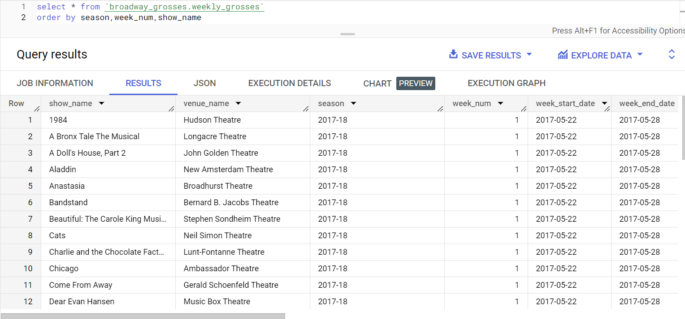

# ETL for Broadway Grosses

## Description

ETL for Broadway Grosses is a program to extract data from a website containing weekly information on Broadway grosses and attendances, clean and transform the data, and load it into a Google BigQuery table.

Also included in here is an analysis.ipynb.
Currently empty, but some analysis to come on broadway grosses/attendance!

My purpose for creating this project was to demonstrate different analytics skills, learn some new ones, and play around with data from an industry I'm passionate about.

I started off with some ETL because it's hard to do analysis work without actual data 🙃

Some Technologies and Skills involved:
- Docker
- Git
- Google Cloud
  - Account and project creation
  - Setting up billing
  - Creating service account
  - Different authentication methods
- Python
  - pandas
  - pandas_gbq
  - bigquery
  - re (regular expressions)
  - BeautifulSoup4 (for parsing web data)

## Table of Contents

- [Prerequisites](#prerequisites)
- [Authentication](#authentication)
- [Installation](#installation)
- [Usage](#usage)
- [ETL Results](#etl_results)
- [Challenges](#challenges)
- [Future Work](#future_work)

## <a id="prerequisites">Prerequisites

1. A Docker Host
2. A Google Cloud account:
   - Create a project
   - Set up billing for the project
   - Create a service account for the project and download the .json file to your local machine or wherever the Docker host is set up
    

## <a id="authentication">Authentication</a>

In order to use Google Cloud resources, we need to make sure the app is authenticating with Google.  There are several different ways to do this... I won't explain them all here. 

The method I will use to be able to run this app in Docker is to create a volume mount at runtime to mount my gcp_secret_key.json file to /app/gcp_secret_key.json.  This allows me to access files from my Windows host from within the container.

## <a id="installation">Installation</a>

1. Clone the repository:
   ```
   git clone https://github.com/mkg144/broadway_grosses.git
   cd broadway_grosses
   ```

3. Create a table in BigQuery within the project you set up using below DDL:
   ```sql
   CREATE TABLE `your_project_id.your_dataset_name.your_table_name`
   (
      show_name STRING,
      venue_name STRING,
      season STRING,
      week_num INT64,
      week_start_date DATE,
      week_end_date DATE,
      tw_gross NUMERIC,
      potential_gross NUMERIC,
      diff_tw_lw_gross NUMERIC,
      avg_ticket_price NUMERIC,
      max_ticket_price NUMERIC,
      seats_sold INT64,
      seats_in_theater INT64,
      performances INT64,
      preview_performances INT64,
      pct_capacity FLOAT64,
      diff_tw_lw_pct_capacity FLOAT64
   );
   ```

4. Edit the variables **proj_id** and **dest_table** in the file main.py.  This should be changed to use the names of your Google Cloud Project ID, Dataset, and Table names.

## <a id="usage">Usage</a>
1. Build the Docker image (if not already built)
   ```docker build -t broadway_grosses_image .```

2. Run the ETL (choose 1 of the 2 methods)
   - Method 1:
      *Without any args on main.py* 
      *(will attempt to ETL most recent week's data from website)*
      
      ```docker run --rm --name [name_for_the_container] -v /path/to/local/gcp_secret_key.json:/app/gcp_secret_key.json [name_for_the_image] python main.py```
      
      <mark style="background-color: #FFFF00">FOR EXAMPLE:</mark>
      
      ```docker run --rm --name broadway_grosses_container -v C:\Users\Michael\credentials\gcp_secret_key.json:/app/gcp_secret_key.json broadway_grosses_image python main.py```
   - Method 2:
      *With args on main.py for season_start week_num_start season_end week_num_end*
      *(ETL's all weeks within that range based on B'way week schedules in a season)*
      
      ```docker run --rm --name [name_for_the_container] -v /path/to/local/gcp_secret_key.json:/app/gcp_secret_key.json [name_for_the_image] python main.py [season_start] [week_num_start] [season_end] [week_num_end]```
      
      <mark style="background-color: #FFFF00">FOR EXAMPLE:</mark>
      
      ```docker run --rm --name broadway_grosses_container -v C:\Users\Michael\credentials\gcp_secret_key.json:/app/gcp_secret_key.json broadway_grosses_image python main.py 2017-18 1 2018-19 52```

3. Interact with the analysis notebook
   *The analysis.ipynb file exists but there's no analysis in it yet*
   
   *For this, we will run the Docker container in interactive mode*
   
   **>> Step 1: Run the container in interactive mode**
   ```docker run -it -p 8888:8888 --name [name_for_the_container] -v /path/to/local/gcp_secret_key.json:/app/gcp_secret_key.json:/app/gcp_secret_key.json [name_for_the_image] bash```
   
     <mark style="background-color: #FFFF00">FOR EXAMPLE:</mark>
   
   ```docker run -it -p 8888:8888 --name broadway_grosses_container -v C:\Users\Michael\credentials\gcp_secret_key.json:/app/gcp_secret_key.json broadway_grosses_image bash```
   
   **>> Step 2: In interactive mode, start Jupyter Notebook server**
   ```jupyter notebook --ip=0.0.0.0 --port=8888 --no-browser --allow-root```
   
   **>> Step 3: Copy/Paste the URL provided into your web browser to access the notebook interface.  It should look something like:**
   http://127.0.0.1:8888/tree?token=the_generated_token

## <a id="etl_results">ETL Results</a>
Here's a screenshot of the resulting BigQuery table after I've ETL'd a bunch of historical data
*(hard to fit in all the columns in a screenshot, but you get the gist)*



## <a id="challenges">Challenges</a>
Many challenges!  But they were fun to work through.

In order to run queries on BigQuery or insert data with pandas_gbq within my python scripts, I have to have some sort of authentication process.  I was trying to figure out what the most secure method would be for my purposes.  In the end, when running this application locally (not on a Docker host), I use a GOOGLE_APPLICATION_CREDENTIALS environment variable on my local pc.  For running things on Docker, I mount the path to the secret .json file at runtime.

Parsing and cleaning the data was a little tricky.  I've only used BeautifulSoup4 once or twice, but once I got the hang of it it was pretty straightforward.  There was a lot of time spent inspecting the website to figure out all of the html and css elements I would need.  Then making sure the datatypes for my columns were how I needed them to be to convert properly when loading to BigQuery took some playing around with.

Learning how to use Docker was very cool.  I'd briefly toyed with it a little bit a couple years back, but now I was able to implement a full project.  And I even got it set up so I can run a Jupyter kernel inside the container and access notebooks in my web browser.

## <i id="future_work">Future Work</a>
I plan to do some analysis of the data and create some visualizations next.

The data I've collected, while there is a lot of historical data available, there aren't that many dimensions with which to cut it.  Things that would be interesting to add in would be the show type (eg. play/musical), Opening Date, Closing Date, creative personas, capitalization cost, weekly operational expenses, DID IT RECOUP!  There are so many other dimensions and facts that could relate well to doing an analyis of Broadway shows, understanding the performance of past productions, and what kinds of predictions can be made about future productions.
